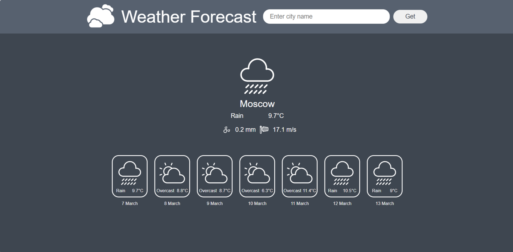

# Weather Forecast Python Project

## Описание проекта (Description)

Веб-приложение для прогноза погоды.
При входе на сайт автоматически показывается прогноз для текущего местоположения клиента.
Если в браузере скрыто отслеживание геолокации, по умолчанию будет выдан прогноз для Москвы.
Пользователь может ввести в форму название города, после чего получит прогноз на ближайшие 7 дней, включая сегодняшнюю дату.
Приложение создано с использованием Django и JavaScript.

This web application provides weather forecasts.
Upon accessing the site, the application automatically displays the weather forecast for the user’s current location.
If geolocation tracking is disabled, the application defaults to showing the forecast for Moscow.
Users can enter a city name into a form to receive a 7-day forecast, including the current day.
The application is built using Django and JavaScript.

## Превью (Preview)

## Реализованные требования (Implemented Requirements)

- Прогноз погоды по текущему местоположению;
- Прогноз погоды по названию города;
- Написаны тесты;
- Создан адаптивный дизайн.

<!--Space-->

- Weather forecast based on current location;
- Weather forecast based on city name;
- Tests written;
- Responsive design created.

## Использованные технологии (Technology Stack)

- **Django**
- **JavaScript**
- **HTML/CSS**